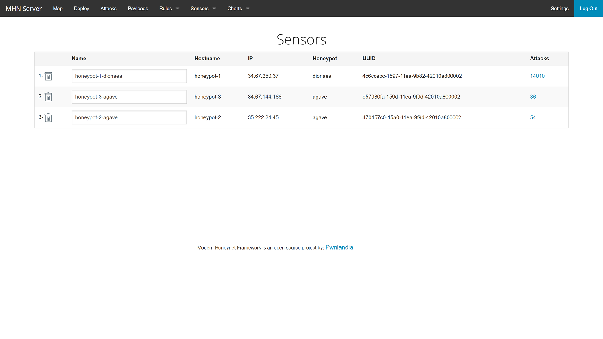

# Week 10-Honeypot

Time Spent: ~8 hours

- The goal for the assignment was to set up a Honeypot to track and collect data about attacks. Overall, this assignment was by no means simple as a lot of set up had to be done first.
- The Honeypots that I attempted to deploy were:
  - Ubuntu/Raspberry Pi - Dionaea
  - Ubuntu/Raspberry Pi - Drupot
  - Ubuntu - Shockpot

- Unfortunately, there were some big issues that I encountered doing these deployments.
  - One of the issues was that none of the attacks made by the other Honeypots other than Dionaea was recorded, and therefore, the JSON file seems to contain all traces from Dionaea only. They did have the most attacks by a long shot, but even filtering the attacks, I did not find any of the other Honeypots recorded.
  - 

  - Second issue was the Shockpot Honeypot itself, which I later deleted because I made no progress with it as the VM kept crashing itself as I try to deploy a script using wget in Kali Linux.

- Some of the unresolved questions I have are:
  - I am not too sure why there are so many attacks coming from the same IP with the same port and protocol. In my case, it would be the 111.250.206.111 port 1433 and I noticed it was constant too, which was strange to me.
